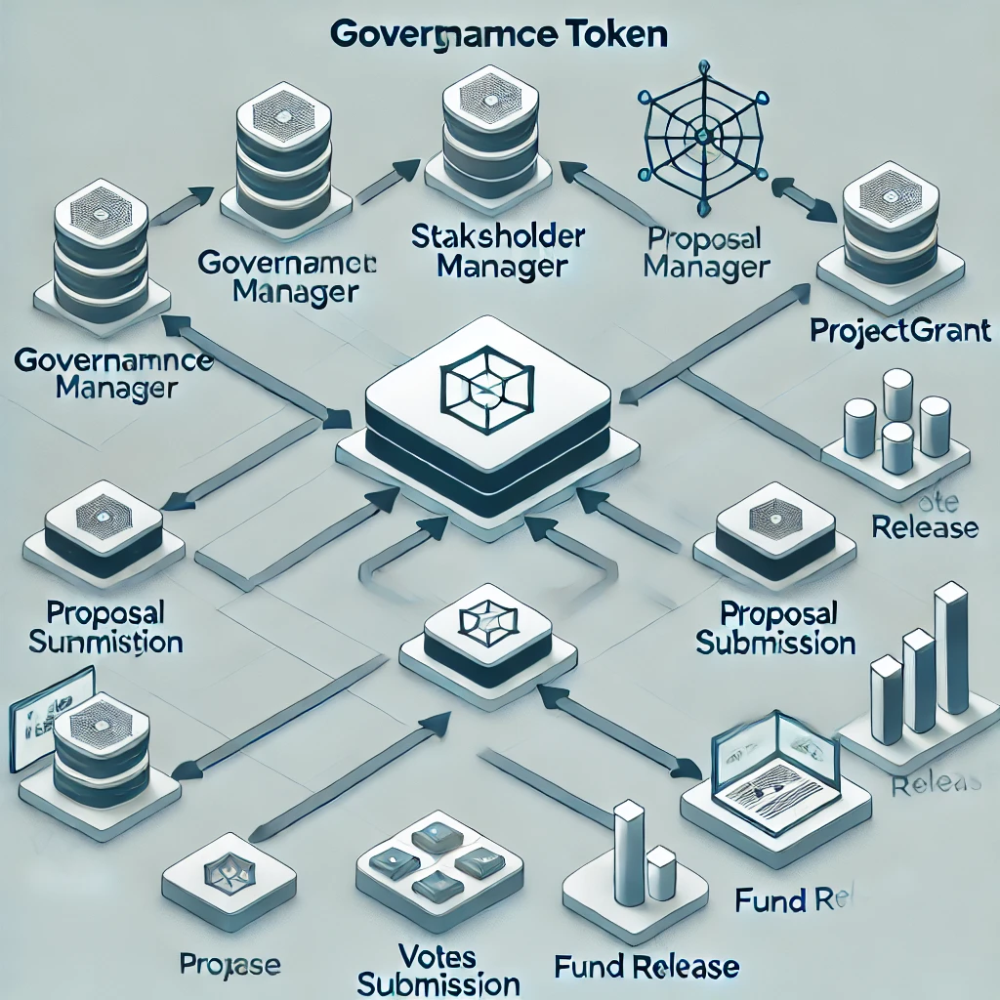

# GrantChain: Decentralized Granting Platform using DAO

## Overview

GrantChain is a decentralized platform designed to revolutionize the grant awarding process. It leverages blockchain technology and decentralized governance to ensure transparency, inclusivity, and community-driven decision-making. This repository contains the smart contracts that power the GrantChain platform, including the governance and staking mechanisms, stakeholder management, and the core logic for project grant proposals and voting.

## Contracts Overview

### 1. **GovernanceToken.sol**
   - ERC20 token used for voting within the DAO. Stakeholders use this token to cast their votes on proposals submitted for grants.

### 2. **ProjectToken.sol**
   - ERC20 token used for staking by participants who wish to submit proposals. Staking ProjectTokens demonstrates commitment to the project.

### 3. **StakeHolderManager.sol**
   - Manages the addition and removal of stakeholders. Only recognized stakeholders can participate in the voting process.

### 4. **ProjectGrant.sol**
   - The core contract for managing grant projects, proposals, voting, and fund release. It allows for the creation of projects by government officials, submission of proposals by participants, and voting by stakeholders.

## Contract Details

### ProjectGrant.sol

- **Data Structures:**
  - **Project:** Stores information about each grant project, including total vote power, total staked amount, owner, metadata, grant amount, and highest voted proposal ID.
  - **Proposal:** Contains details about each proposal, including the project ID, total vote power, stake amount, owner, and metadata.
  - **Vote:** Tracks each vote cast, including the proposal ID, project ID, vote power, owner, and status.
  
- **Core Functions:**
  - **createProject:** Allows a government official to create a new grant project by depositing the grant amount.
  - **vote:** Enables stakeholders to vote on proposals by staking their governance tokens.
  - **createProposal:** Allows participants to submit proposals for a specific project by staking ProjectTokens.
  - **cancelProposal:** Enables a participant to cancel their proposal and retrieve their staked tokens.
  - **claimVote:** Allows stakeholders to claim back their vote tokens once a project is finalized.
  - **finaliseProject:** Finalizes the project and locks further changes.
  - **releaseFund:** Releases the grant amount to the winning proposal.

## Contract Architecture Diagram

Below is a simplified diagram illustrating the relationship between the smart contracts:

## Deployment

To deploy these contracts on a blockchain, you'll need to follow these steps:

1. **Compile Contracts:** Use tools like Truffle or Hardhat to compile the smart contracts.
2. **Deploy GovernanceToken.sol:** Deploy the GovernanceToken contract first.
3. **Deploy ProjectToken.sol:** Deploy the ProjectToken contract next.
4. **Deploy StakeHolderManager.sol:** Deploy the StakeHolderManager contract and register stakeholders.
5. **Deploy ProjectGrant.sol:** Finally, deploy the ProjectGrant contract, passing the addresses of the GovernanceToken, ProjectToken, and StakeHolderManager contracts.

## Running Tests

To ensure the contracts function as expected, you can run unit tests. Tests should cover:

- Token transfers and staking.
- Project creation and proposal submission.
- Voting and fund release mechanisms.

## Challenges & Learnings

During development, ensuring the security of smart contracts was a key challenge, particularly in preventing reentrancy attacks and ensuring proper management of token balances. We also focused on creating an intuitive interface for users who may not be familiar with blockchain technology.

## Future Work

In the future, we plan to enhance the voting mechanisms to include more sophisticated options, such as quadratic voting or weighted voting. Additionally, we aim to onboard more participants and government bodies to increase the platform’s reach and impact.

## License

This project is licensed under the MIT License. See the LICENSE file for more details.
